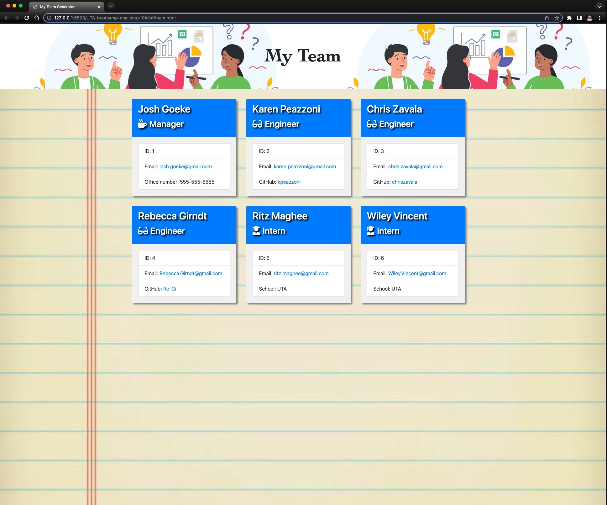

# The Team Generator Project

## Description 
The objective for this project was to build a Node.js command-line application that takes in information about employees on a team, and with that information generates an HTML webpage that displays the user input data. In addition to building the application, this project also required the use of Jest and Inquirer to conduct unit tests of every part of the code to ensure that it would pass each test. Please enjoy the application and hope it adds functional use to your teams production.
 
## Table of Contents
\
A version of the Table of Contents will be included to show a screenshot description of what th Team Generator will look like.

  - [Installation](#installation)
  - [Usage](#usage)
  - [Credits](#credits)
  - [License](#license)
  - [User Story](#user-story)
  - [Acceptance Criteria](#acceptance-criteria)
  - [Features](#features)
  - [How To Contribute](#how-to-contribute)
  - [Author](#author)
  - [Test](#test)

## Installation 
 \
You will have to make sure that 'Node' is installed on your system. Then you will have to make sure the contents of the repository are clone on your workstation. Once you have the contents of the 'UTA-Bootcamp-Challenge10' you will be able to run the application.

## Usage
To run this application you need to run this:


```bash
node index.js
``` 


## Credits
List your collaborators, if any, with links to their GitHub profiles.

Karen Peazzoni: https://github.com/kpeazzoni \
Josh Goeke: https://github.com/joshuagoeke \
Myeonghun Jeong: https://github.com/mjtic \
Rebecca Girndt: <https://github.com/Re-Gi> 

Bootstrap: https://getbootstrap.com/ \
NodeJS: https://nodejs.org/en/ \
Jest: https://www.npmjs.com/package/jest \
Inquirer: https://www.npmjs.com/package/inquirer


  
## License 
\
[](https://choosealicense.com/licenses/mit-license/.)
\
MIT License rights are used for this open source project. 


## User Story

```md
AS A manager
I WANT to generate a webpage that displays my team's basic info
SO THAT I have quick access to their emails and GitHub profiles
```
  
## Acceptance Criteria 
  ```md
GIVEN a command-line application that accepts user input
WHEN I am prompted for my team members and their information
THEN an HTML file is generated that displays a nicely formatted team roster based on user input
WHEN I click on an email address in the HTML
THEN my default email program opens and populates the TO field of the email with the address
WHEN I click on the GitHub username
THEN that GitHub profile opens in a new tab
WHEN I start the application
THEN I am prompted to enter the team manager’s name, employee ID, email address, and office number
WHEN I enter the team manager’s name, employee ID, email address, and office number
THEN I am presented with a menu with the option to add an engineer or an intern or to finish building my team
WHEN I select the engineer option
THEN I am prompted to enter the engineer’s name, ID, email, and GitHub username, and I am taken back to the menu
WHEN I select the intern option
THEN I am prompted to enter the intern’s name, ID, email, and school, and I am taken back to the menu
WHEN I decide to finish building my team
THEN I exit the application, and the HTML is generated
```
 
## Features
This application is using 'Node' and the 'Inquirer 8.2.4' npm modules for creating of the 'My Team' html. The feature that this project challenge has is the abilty to create is the that your are able to seperate your team members by catagory. Either defined by Manager, Engineer, or Intern. 

## How to Contribute
You can contribute to the project by email me at: frappejcat@gmail.com 

## Author 
Christopher Zavala:
https://github.com/chriszavala 

## Test
Using Jest for all test. The testing files are located in the "__tests__" directory.  

## Video Link inserted here:
https://drive.google.com/file/d/1V5_c9-8y-E5vH2sCafGlsv7n5RICGT3M/view

## Screenshots:




